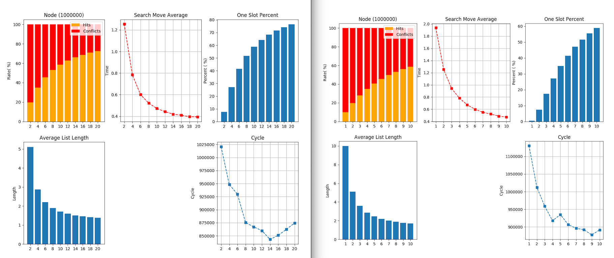

# Search Algorithm Compare

## 개선된 알고리즘과 Binary Search 의 성능 비교
### 1. Buffer Size 별 성능 비교 ( 탐색 수 100만)
.png)
> Buffer 사이즈를 10만으로 했을 경우

.png)
> Buffer 사이즈를 100만으로 했을 경우

.png)
> Buffer 사이즈를 1000만으로 했을 경우

### 2. 탐색 수를 1000만으로 늘렸을 경우
.png)
> Buffer 사이즈를 100만으로 했을 경우

.png)
> Buffer 사이즈를 1000만으로 했을 경우

## Buffer 크기에 대한 성능 비교

> 왼쪽 그림은 버퍼 크기를 200만, 오른쪽 그림은 100만 단위로 측정

그래프를 봤을 때 Conflict가 60%가 넘어가면 급격하게 Cycle수가 증가하는 것을 볼 수 있다.
Conflict가 50% 미만인 부분부터 cycle 수가 안정적인 상태가 되는 것을 볼 수 있다. 그래프를 봤을 때 Sample의 개수와 Buffer 사이즈를 같게 하는 경우 적절한 메모리 사용량과 탐색 시간을 가질 수 있을 거라고 생각한다.

